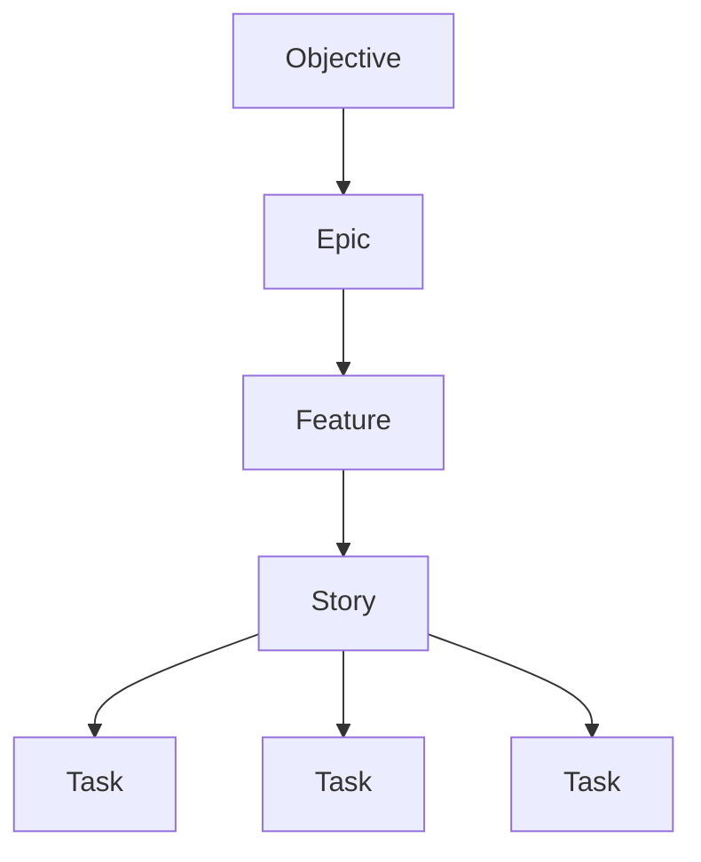

# Requirements Decomposition

This document outlines how to **decompose objectives into actionable work items** (Epics, Features, Stories, Tasks) using a **structured, traceable approach**.

---

## Work Breakdown Structure
The **Work Breakdown Structure (WBS)** is a hierarchical decomposition of the project into smaller, manageable components. Abbey uses the following structure:



---

## Objective
An **Objective** defines the **high-level outcome** the project aims to achieve. It answers:
- Why are we doing this?
- Who benefits?
- What measurable outcome should change?
- What does success look like?

### **Example**
```markdown
**Objective**: Improve user retention by 20% in Q1 2027.
- **Why**: High churn rate is impacting revenue.
- **Who**: Existing users of the platform.
- **Measurable Outcome**: 20% increase in user retention.
- **Success**: Achieve 80% retention rate by March 31, 2027.
```

---

## Epic
An **Epic** is a **large body of work** representing a **meaningful business or product outcome**. It is typically broken down into **Features**.

### **Required Fields**
- **Name**: Clear, concise title.
- **Problem**: The problem this Epic solves.
- **Objective**: The desired outcome.
- **Scope**: What is included.
- **Out of Scope**: What is explicitly excluded.
- **Success Criteria**: Measurable outcomes.
- **Features**: List of Features under this Epic.
- **Dependencies**: External or internal dependencies.
- **Risks**: Potential risks and mitigations.
- **Assumptions**: Key assumptions.
- **Milestone**: Target timeline.
- **Owner**: Responsible person/team.

### **Example**
```markdown
**Epic**: Enhance User Onboarding Experience
- **Problem**: Users drop off during onboarding due to complexity.
- **Objective**: Simplify onboarding to reduce drop-off rate by 30%.
- **Scope**: Redesign onboarding flow, add tooltips, and improve documentation.
- **Out of Scope**: Backend changes, third-party integrations.
- **Success Criteria**: 30% reduction in drop-off rate during onboarding.
- **Features**: 
  - Redesign onboarding UI
  - Add interactive tooltips
  - Improve onboarding documentation
- **Dependencies**: UI/UX team availability.
- **Risks**: Delay in UI/UX team availability.
- **Assumptions**: Users will engage with tooltips.
- **Milestone**: Q1 2027
- **Owner**: Product Team
```

---

## Feature
A **Feature** is a **coherent capability** that contributes to an Epic. It is typically broken down into **Stories**.

### **Required Fields**
- **Name**: Clear, concise title.
- **Capability**: What capability are we delivering?
- **Who Uses It?**: Who is the target user?
- **Why Does It Matter?**: Why is this Feature important?
- **Expected Behavior**: What behavior is expected?
- **Out of Scope**: What is explicitly excluded?
- **Acceptance Criteria**: How will we know the Feature is complete?
- **Dependencies**: What blocks this Feature?
- **Owner**: Who is responsible for this Feature?

### **Example**
```markdown
**Feature**: Add Interactive Tooltips
- **Capability**: Provide users with contextual guidance during onboarding.
- **Who Uses It?**: New users during onboarding.
- **Why Does It Matter?**: Reduces confusion and improves user experience.
- **Expected Behavior**: Tooltips appear when users hover over key elements.
- **Out of Scope**: Mobile app tooltips (for now).
- **Acceptance Criteria**: 
  - Tooltips appear on hover for all key onboarding elements.
  - Tooltips are dismissible.
- **Dependencies**: UI/UX design for tooltips.
- **Owner**: Frontend Team
```

---

## Story
A **Story** is a **small, testable unit of user-facing behavior**. It follows the format:
```
As a [user], I want [capability], so that [outcome].
```

### **Required Fields**
- **User/Value Statement**: `As a [user], I want [capability], so that [outcome].`
- **Context**: Additional context for the Story.
- **Acceptance Criteria**: Given/When/Then format.
- **Dependencies**: What blocks this Story?
- **Edge Cases**: Any edge cases to consider.
- **Definition of Done**: What does "done" look like?

### **Example**
```markdown
**Story**: As a new user, I want to see tooltips during onboarding, so that I understand how to use the platform.
- **Context**: Users often drop off during onboarding due to lack of guidance.
- **Acceptance Criteria**:
  - **Given** I am a new user on the onboarding page,
  - **When** I hover over a key element,
  - **Then** a tooltip appears with contextual guidance.
- **Dependencies**: Tooltip design from UI/UX team.
- **Edge Cases**: 
  - Tooltips should not appear on mobile devices (for now).
  - Tooltips should be accessible via keyboard navigation.
- **Definition of Done**:
  - [ ] Tooltips implemented and tested.
  - [ ] Tooltips are dismissible.
  - [ ] Tooltips work on all key onboarding elements.
```

---

## Task
A **Task** is an **implementation-oriented unit of work**. It is typically assigned to a single person or team.

### **Required Fields**
- **Name**: Clear, concise title.
- **Description**: What needs to be done?
- **Owner**: Who is responsible for this Task?
- **Dependencies**: What blocks this Task?
- **Verification**: How will we know the Task is complete?
- **Priority**: `LOW` / `MEDIUM` / `HIGH` / `CRITICAL`

### **Example**
```markdown
**Task**: Implement Tooltip Component
- **Description**: Create a reusable tooltip component for the onboarding flow.
- **Owner**: Frontend Developer
- **Dependencies**: Tooltip design from UI/UX team.
- **Verification**: Tooltip component is tested and merged into the main branch.
- **Priority**: HIGH
```

---

## Bug
A **Bug** represents **behavior that does not meet expected behavior**.

### **Required Fields**
- **Name**: Clear, concise title.
- **Summary**: Brief description of the Bug.
- **Expected Behavior**: What should happen?
- **Actual Behavior**: What is happening instead?
- **Reproduction Steps**: How can this Bug be reproduced?
- **Environment**: OS, Browser, Version, etc.
- **Severity**: `LOW` / `MEDIUM` / `HIGH` / `CRITICAL`
- **Impact**: What is the impact of this Bug?
- **Frequency**: `Always` / `Often` / `Sometimes` / `Rarely`
- **Evidence**: Screenshots, logs, etc.
- **Suspected Area**: Where do you think the issue is?
- **Workaround**: Is there a temporary workaround?
- **Regression Information**: When was this Bug introduced?
- **Fix Criteria**: How will we know the Bug is fixed?
- **Owner**: Who is responsible for fixing this Bug?

### **Example**
```markdown
**Bug**: Tooltip Not Appearing on Hover
- **Summary**: Tooltips do not appear when hovering over elements during onboarding.
- **Expected Behavior**: Tooltip appears on hover.
- **Actual Behavior**: No tooltip appears.
- **Reproduction Steps**:
  1. Navigate to the onboarding page.
  2. Hover over a key element.
  3. Observe that no tooltip appears.
- **Environment**: Chrome v120, macOS
- **Severity**: HIGH
- **Impact**: Users may not understand how to use the platform.
- **Frequency**: Always
- **Evidence**: Screenshot of the issue.
- **Suspected Area**: Frontend tooltip implementation.
- **Workaround**: None.
- **Regression Information**: Introduced in v2.1.0.
- **Fix Criteria**: Tooltip appears on hover for all key elements.
- **Owner**: Frontend Developer
```

---

## Dependency
A **Dependency** describes a **relationship between pieces of work**.

### **Types of Dependencies**
- **Hard Dependency**: Must be completed before the dependent work can start.
- **Soft Dependency**: Preferred but not mandatory.
- **External Dependency**: Relies on a third party or external team.
- **Technical Dependency**: Relies on a technical component or system.

### **Required Fields**
- **Source**: What is the source of this Dependency?
- **Target**: What does this Dependency affect?
- **Relationship**: `blocks` / `blocked-by` / `depends-on` / `enables`
- **Reason**: Why does this Dependency exist?
- **Owner**: Who is responsible for resolving this Dependency?
- **Status**: `OPEN` / `RESOLVED` / `BLOCKED`
- **Required-by Date**: When does this Dependency need to be resolved?
- **Risk**: `LOW` / `MEDIUM` / `HIGH` / `CRITICAL`
- **Mitigation**: How can this Dependency be resolved or mitigated?

### **Example**
```markdown
**Dependency**: UI/UX Design for Tooltips
- **Source**: Tooltip Feature
- **Target**: Tooltip Implementation Task
- **Relationship**: blocks
- **Reason**: Implementation cannot start without the design.
- **Owner**: UI/UX Team
- **Status**: OPEN
- **Required-by Date**: 2027-02-15
- **Risk**: HIGH (delays implementation)
- **Mitigation**: Follow up with UI/UX team for priority.
```

---

## Best Practices
1. **Start with Objectives**: Always begin with a clear **Objective** to guide decomposition.
2. **Break Down Epics**: Decompose Epics into **Features**, then into **Stories** and **Tasks**.
3. **Keep Stories Small**: Stories should be **small enough to complete in a single sprint**.
4. **Define Acceptance Criteria**: Ensure every Story and Feature has **clear, testable acceptance criteria**.
5. **Identify Dependencies Early**: Document dependencies as soon as they are identified.
6. **Prioritize Tasks**: Assign **priority levels** to Tasks to focus on high-value work.
7. **Review Regularly**: Continuously review and refine the decomposition as the project evolves.

---

## Tools for Decomposition
- **Mind Maps**: Visualize the breakdown of objectives into Epics, Features, and Stories.
- **User Story Mapping**: Map user journeys to identify Stories and Features.
- **Dependency Diagrams**: Visualize dependencies between work items.
- **Prioritization Matrices**: Prioritize work based on impact and effort.