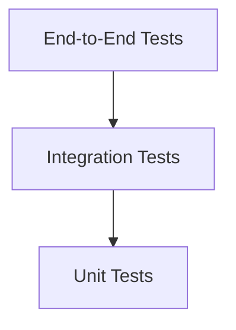

# Testing Strategy

This document outlines **best practices for testing software** to ensure **quality, reliability, and maintainability**. A well-defined testing strategy helps teams **catch bugs early**, **reduce technical debt**, and **deliver robust software**.

---

## Overview
Testing is the process of **evaluating a system or its components** to ensure it meets specified requirements. A **comprehensive testing strategy** includes multiple types of tests, each serving a unique purpose.

---

## Types of Testing

### **1. Unit Testing**
- **Definition**: Testing **individual components or functions** in isolation.
- **Purpose**: Verify that each unit of code works as expected.
- **Tools**:
  - JavaScript: Jest, Mocha, Chai
  - Python: pytest, unittest
  - Java: JUnit, TestNG
  - C#: NUnit, xUnit
- **Example**:
  ```javascript
  // Example: Jest test for a sum function
  test('adds 1 + 2 to equal 3', () => {
    expect(sum(1, 2)).toBe(3);
  });
  ```

### **2. Integration Testing**
- **Definition**: Testing the **interaction between multiple components or modules**.
- **Purpose**: Ensure that integrated components work together as expected.
- **Tools**:
  - JavaScript: Jest, Supertest
  - Python: pytest
  - Java: TestNG
- **Example**:
  ```javascript
  // Example: Integration test for an API endpoint
  test('GET /api/users returns 200', async () => {
    const response = await request(app).get('/api/users');
    expect(response.status).toBe(200);
  });
  ```

### **3. End-to-End (E2E) Testing**
- **Definition**: Testing the **entire application flow** from start to finish.
- **Purpose**: Ensure the application works as expected in a **real-world scenario**.
- **Tools**:
  - Cypress
  - Selenium
  - Playwright
  - Puppeteer
- **Example**:
  ```javascript
  // Example: Cypress E2E test for user login
  describe('User Login', () => {
    it('logs in successfully with valid credentials', () => {
      cy.visit('/login');
      cy.get('#username').type('user123');
      cy.get('#password').type('password123');
      cy.get('#login-button').click();
      cy.url().should('include', '/dashboard');
    });
  });
  ```

### **4. Performance Testing**
- **Definition**: Testing the **speed, scalability, and stability** of an application under load.
- **Purpose**: Identify performance bottlenecks and ensure the application can handle expected user loads.
- **Tools**:
  - JMeter
  - LoadRunner
  - k6
  - Lighthouse (for web performance)
- **Metrics**:
  - **Response Time**: Time taken to respond to a request.
  - **Throughput**: Number of requests processed per unit of time.
  - **Latency**: Delay before a transfer of data begins.
  - **Error Rate**: Percentage of requests that fail.

### **5. Security Testing**
- **Definition**: Testing for **vulnerabilities, threats, and risks** in an application.
- **Purpose**: Ensure the application is **secure** and compliant with security standards.
- **Tools**:
  - OWASP ZAP
  - Burp Suite
  - Snyk
  - Nessus
- **Types**:
  - **Static Application Security Testing (SAST)**: Analyze code for vulnerabilities.
  - **Dynamic Application Security Testing (DAST)**: Test running applications for vulnerabilities.
  - **Penetration Testing**: Simulate attacks to identify security weaknesses.

### **6. Accessibility Testing**
- **Definition**: Testing to ensure the application is **usable by people with disabilities**.
- **Purpose**: Comply with **accessibility standards** (e.g., WCAG, ADA).
- **Tools**:
  - axe
  - WAVE
  - Lighthouse (for web accessibility)
  - Screen readers (e.g., NVDA, JAWS)
- **Standards**:
  - **WCAG (Web Content Accessibility Guidelines)**: International standard for web accessibility.
  - **ADA (Americans with Disabilities Act)**: U.S. law requiring accessibility.

### **7. Usability Testing**
- **Definition**: Testing the **user experience (UX)** of an application.
- **Purpose**: Ensure the application is **intuitive, user-friendly, and meets user needs**.
- **Methods**:
  - **User Interviews**: Gather feedback from real users.
  - **Surveys**: Collect quantitative feedback.
  - **A/B Testing**: Compare two versions of a feature to determine which performs better.
  - **Heuristic Evaluation**: Expert review of the application against usability principles.

---

## Testing Pyramid
The **Testing Pyramid** is a **visual representation** of the ideal distribution of test types in a project:



- **Unit Tests**: **70%** of tests (fast, isolated, cheap to maintain).
- **Integration Tests**: **20%** of tests (test interactions between components).
- **End-to-End Tests**: **10%** of tests (slow, expensive, but critical for user flows).

---

## Testing Best Practices
1. **Write Tests Early**: Follow **Test-Driven Development (TDD)** or **Behavior-Driven Development (BDD)** to write tests before or alongside code.
2. **Automate Tests**: Automate **unit, integration, and E2E tests** to run frequently.
3. **Test Coverage**: Aim for **high test coverage** (e.g., 80-90%) to ensure most code paths are tested.
4. **Isolate Tests**: Ensure tests are **independent** and do not rely on external factors (e.g., databases, APIs).
5. **Mock Dependencies**: Use **mocks or stubs** to simulate external dependencies (e.g., APIs, databases).
6. **Test Edge Cases**: Include tests for **edge cases, error conditions, and invalid inputs**.
7. **Continuous Testing**: Integrate testing into your **CI/CD pipeline** to run tests automatically.
8. **Review Test Code**: Treat test code with the same **care and review** as production code.

---

## Testing in CI/CD
Integrate testing into your **CI/CD pipeline** to ensure tests run automatically:

### **Example: GitHub Actions Workflow**
```yaml
# .github/workflows/test.yml
name: Run Tests

on: [push, pull_request]

jobs:
  test:
    runs-on: ubuntu-latest
    steps:
      - name: Checkout code
        uses: actions/checkout@v4

      - name: Set up Node.js
        uses: actions/setup-node@v4
        with:
          node-version: 20

      - name: Install dependencies
        run: npm install

      - name: Run unit tests
        run: npm test

      - name: Run integration tests
        run: npm run test:integration

      - name: Run E2E tests
        run: npm run test:e2e
```

---

## Common Testing Challenges
| Challenge | Description | Solution |
|-----------|-------------|----------|
| **Flaky Tests** | Tests that pass or fail unpredictably. | Fix or quarantine flaky tests. |
| **Slow Tests** | Tests that take too long to run. | Optimize tests, parallelize execution. |
| **Test Debt** | Outdated or missing tests. | Prioritize updating tests alongside code changes. |
| **Environment Issues** | Tests fail due to environment differences. | Use **Docker containers** or **consistent environments**. |
| **False Positives/Negatives** | Tests that incorrectly pass or fail. | Improve test logic and assertions. |

---

## Testing Tools by Language
| Language | Unit Testing | Integration Testing | E2E Testing |
|----------|--------------|---------------------|-------------|
| JavaScript | Jest, Mocha | Supertest, Jest | Cypress, Playwright |
| Python | pytest, unittest | pytest | Selenium |
| Java | JUnit, TestNG | TestNG | Selenium |
| C# | NUnit, xUnit | xUnit | Selenium |
| Go | testing | testing | Cypress |
| Ruby | RSpec, Minitest | RSpec | Capybara |

---

## Resources
- [Jest Documentation](https://jestjs.io/docs/getting-started)
- [pytest Documentation](https://docs.pytest.org/en/7.4.x/)
- [Cypress Documentation](https://docs.cypress.io/guides/overview/why-cypress)
- [Selenium Documentation](https://www.selenium.dev/documentation/)
- [OWASP Testing Guide](https://owasp.org/www-project-web-security-testing-guide/)
- [WCAG Guidelines](https://www.w3.org/WAI/standards-guidelines/wcag/)
- [Test-Driven Development (TDD)](https://en.wikipedia.org/wiki/Test-driven_development)
- [Behavior-Driven Development (BDD)](https://cucumber.io/docs/bdd/)