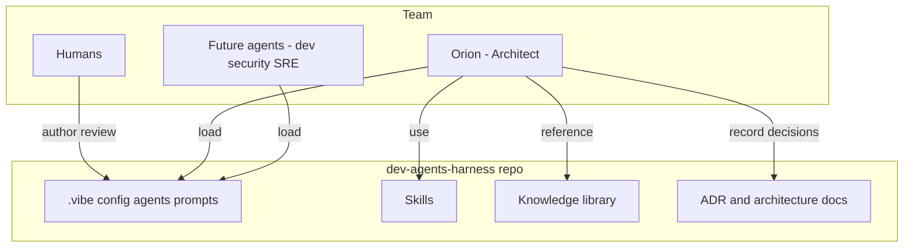

# System Context — dev-agents-harness

This repo is **configuration, not an application**. It is the shared source of truth for agent definitions, skills, knowledge, and decisions. Agents load from it; humans and agents extend it via PRs (see CONTRIBUTING.md).
